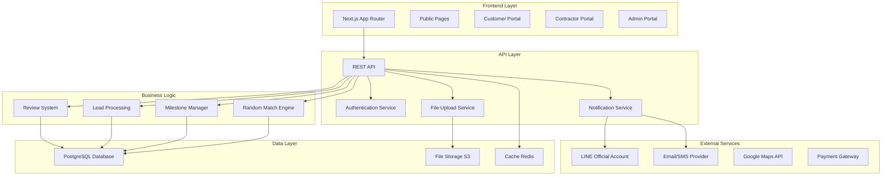
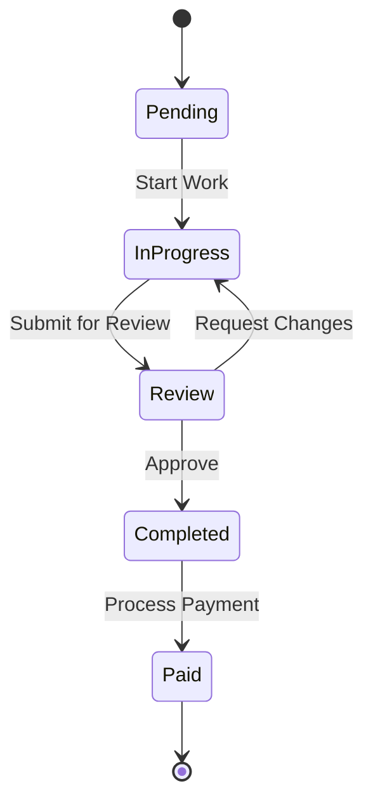
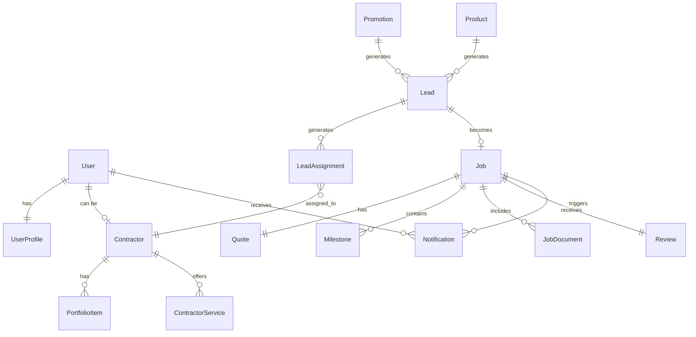

# Design Document

## Overview

SPIDER is a contractor marketplace platform built with modern web technologies to provide a seamless experience for customers, contractors, and back-office staff. The system implements a unique Random Match algorithm, milestone-based project management, and comprehensive dashboards for all user types.

The platform follows a microservices-inspired architecture with clear separation between public-facing content, user portals, and administrative functions, while maintaining a unified user experience.

## Architecture

### High-Level Architecture



### Technology Stack

**Frontend:**

- Next.js 14+ with App Router for SSR/ISR and optimal SEO
- TypeScript for type safety and developer experience
- Tailwind CSS for responsive, utility-first styling
- React Hook Form for form management and validation
- Zustand for client-side state management
- React Query for server state management and caching

**Backend:**

- Node.js with NestJS framework for scalable API architecture
- Prisma ORM for type-safe database operations
- PostgreSQL for primary data storage
- Redis for caching and session management
- Bull Queue for background job processing

**Infrastructure:**

- Vercel for frontend hosting with edge functions
- AWS S3 for file storage and CDN
- Railway/Render for backend hosting
- GitHub Actions for CI/CD pipeline

## Components and Interfaces

### Core Components

#### 1. Authentication & Authorization System

**JWT-based Authentication:**

- Access tokens (15 minutes) and refresh tokens (7 days)
- Role-based access control (RBAC) with granular permissions
- Magic link authentication for contractors
- 2FA for admin and back-office users

**User Roles & Permissions:**

```typescript
enum UserRole {
  VISITOR = 'visitor',
  CUSTOMER = 'customer',
  CONTRACTOR = 'contractor',
  COORDINATOR = 'coordinator',
  SALES = 'sales',
  ADMIN = 'admin',
}

interface Permission {
  resource: string;
  actions: ('create' | 'read' | 'update' | 'delete')[];
}
```

#### 2. Random Match Engine

**Matching Algorithm:**

- Service type compatibility scoring
- Geographic proximity calculation (radius-based)
- Contractor availability checking
- Rating and success rate weighting
- Budget range alignment
- Workload balancing

**Implementation:**

```typescript
interface MatchCriteria {
  serviceType: string;
  location: GeoPoint;
  budget: BudgetRange;
  urgency: 'low' | 'medium' | 'high';
  customerPreferences?: ContractorPreferences;
}

interface MatchResult {
  contractors: ContractorMatch[];
  confidence: number;
  reasoning: string[];
}
```

#### 3. Milestone Management System

**Milestone Workflow:**

- Quote approval triggers milestone creation
- Automatic status progression with manual overrides
- Payment integration with milestone completion
- Customer and contractor notifications

**Status Flow:**



#### 4. Notification System

**Multi-channel Notifications:**

- Email notifications for formal communications
- LINE OA for real-time updates (Thai market preference)
- In-app notifications for immediate actions
- SMS for critical alerts

**Notification Types:**

- Lead submissions and assignments
- Match results and contractor responses
- Milestone updates and payment confirmations
- Review requests and system alerts

### User Interface Components

#### 1. Public Website Components

**Homepage:**

- Hero section with service search
- Featured service categories grid
- Contractor spotlight carousel
- Promotional banners
- Trust indicators (reviews, completed projects)

**Service Pages:**

- Service category overview
- Contractor filtering and search
- Lead capture forms
- Success stories and testimonials

**Smart Home Product Pages:**

- Product catalog with filtering
- Detailed product specifications
- Installation service integration
- Lead generation forms

#### 2. Customer Portal Components

**Dashboard:**

- Active projects overview
- Milestone progress tracking
- Recent notifications
- Quick actions (new project, messages)

**Project Management:**

- Detailed project timeline
- Document management
- Contractor communication
- Payment history

#### 3. Contractor Portal Components

**Dashboard:**

- Earnings overview with monthly breakdown
- Work schedule calendar
- Job opportunity notifications
- Performance metrics

**Profile Management:**

- Service offerings configuration
- Portfolio management
- Availability settings
- Pricing and service area setup

#### 4. Admin Portal Components

**Moderation Queue:**

- Contractor approval workflow
- Content moderation tools
- Lead assignment interface
- System health monitoring

**Analytics Dashboard:**

- Platform usage metrics
- Revenue tracking
- User engagement analytics
- Performance monitoring

## Data Models

### Core Entities

```typescript
// User Management
interface User {
  id: string;
  email: string;
  phone: string;
  role: UserRole;
  profile: UserProfile;
  createdAt: Date;
  updatedAt: Date;
}

interface UserProfile {
  firstName: string;
  lastName: string;
  avatar?: string;
  language: 'th' | 'en';
  notifications: NotificationPreferences;
}

// Contractor System
interface Contractor {
  id: string;
  userId: string;
  businessName: string;
  services: ServiceType[];
  serviceAreas: Province[];
  experience: number;
  portfolio: PortfolioItem[];
  verification: VerificationStatus;
  ratings: ContractorRating;
  availability: AvailabilitySettings;
}

interface ContractorRating {
  average: number;
  totalReviews: number;
  successRate: number;
  responseTime: number;
}

// Lead and Job Management
interface Lead {
  id: string;
  customerId: string;
  serviceType: ServiceType;
  description: string;
  location: Location;
  budget: BudgetRange;
  urgency: UrgencyLevel;
  status: LeadStatus;
  assignedContractors: string[];
  createdAt: Date;
}

interface Job {
  id: string;
  leadId: string;
  contractorId: string;
  customerId: string;
  quote: Quote;
  milestones: Milestone[];
  status: JobStatus;
  documents: Document[];
}

interface Milestone {
  id: string;
  jobId: string;
  title: string;
  description: string;
  amount: number;
  dueDate: Date;
  status: MilestoneStatus;
  completedAt?: Date;
}

// Content Management
interface Promotion {
  id: string;
  title: string;
  description: string;
  image: string;
  validFrom: Date;
  validTo: Date;
  serviceTypes: ServiceType[];
  isActive: boolean;
}

interface Product {
  id: string;
  category: 'solar' | 'ev-charger' | 'smart-device';
  name: string;
  description: string;
  specifications: Record<string, any>;
  images: string[];
  priceRange: BudgetRange;
}
```

### Database Schema Relationships



## Error Handling

### Error Categories and Responses

**Validation Errors (400):**

- Form validation failures
- Business rule violations
- Invalid request parameters

**Authentication Errors (401/403):**

- Invalid or expired tokens
- Insufficient permissions
- Account verification required

**Business Logic Errors (422):**

- Contractor unavailable for matching
- Milestone progression violations
- Payment processing failures

**System Errors (500):**

- Database connection failures
- External service timeouts
- Unexpected application errors

### Error Response Format

```typescript
interface ErrorResponse {
  error: {
    code: string;
    message: string;
    details?: Record<string, any>;
    timestamp: string;
    requestId: string;
  };
}
```

### Retry and Fallback Strategies

**Critical Operations:**

- Payment processing: 3 retries with exponential backoff
- Notification delivery: Queue-based retry with dead letter handling
- External API calls: Circuit breaker pattern with fallback responses

**User Experience:**

- Graceful degradation for non-critical features
- Offline capability for viewing cached data
- Clear error messages with suggested actions

## Testing Strategy

### Testing Pyramid

**Unit Tests (70%):**

- Business logic functions
- Utility functions and helpers
- Component logic and hooks
- API endpoint handlers

**Integration Tests (20%):**

- Database operations
- External service integrations
- API endpoint workflows
- Authentication flows

**End-to-End Tests (10%):**

- Critical user journeys
- Cross-browser compatibility
- Mobile responsiveness
- Performance benchmarks

### Test Scenarios

**Random Match Engine:**

- Contractor availability verification
- Geographic proximity calculations
- Rating and preference weighting
- Edge cases (no available contractors)

**Milestone Management:**

- Status progression workflows
- Payment integration flows
- Notification triggering
- Concurrent update handling

**User Authentication:**

- Role-based access control
- Token refresh mechanisms
- Magic link authentication
- 2FA implementation

### Performance Testing

**Load Testing:**

- Concurrent user scenarios
- Database query optimization
- API response time benchmarks
- File upload performance

**Accessibility Testing:**

- Screen reader compatibility
- Keyboard navigation
- Color contrast validation
- Focus management

### Security Testing

**Penetration Testing:**

- SQL injection prevention
- XSS attack mitigation
- CSRF protection validation
- File upload security

**Data Protection:**

- PII encryption verification
- Secure data transmission
- Access control validation
- Audit log integrity

## Deployment and Monitoring

### Deployment Strategy

**Environment Setup:**

- Development: Local with Docker Compose
- Staging: Production-like environment for UAT
- Production: Multi-region deployment with CDN

**CI/CD Pipeline:**

- Automated testing on pull requests
- Security scanning and dependency checks
- Automated deployment to staging
- Manual approval for production deployment

### Monitoring and Observability

**Application Monitoring:**

- Error tracking with Sentry
- Performance monitoring with Web Vitals
- User analytics with privacy-compliant tools
- Business metrics dashboard

**Infrastructure Monitoring:**

- Server health and resource usage
- Database performance metrics
- API response times and error rates
- External service availability

**Alerting:**

- Critical error notifications
- Performance degradation alerts
- Security incident notifications
- Business metric anomalies
